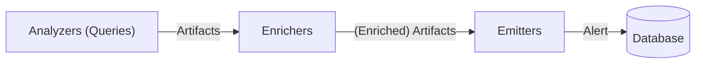
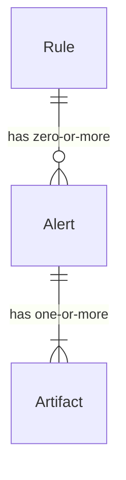
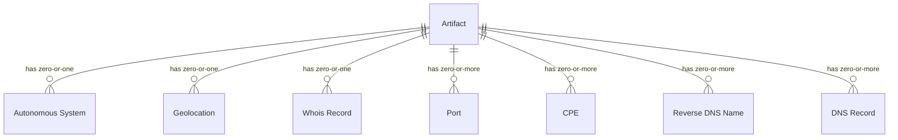

# Rule

<figure markdown>
  {: style="width:480px"}
</figure>

---

A rule is composed by three main components. Analyzers (queries), enrichers and emitters.

- Analyzers (Queries): a list of queries (analyzers) that builds a list of artifacts.
- Enrichers: a list of enrichers that enriches a list of artifacts.
- Emitters: a list of emitters that emits a list of artifacts as an alert.



- A rule has zero or more alerts.
- A alert has one or more artifacts.



An artifact can have following data types:

- IP address (`ip`)
- Domain (`domain`)
- URL (`url`)
- Mail (`mail`)
- Hash (`hash`)

An artifact can also have the following components:



A rule is assumed to be continuously searched. An alert generated by a rule will only have new findings at that time.

!!! tip

    You can control how Mihari checks the freshness via [artiact_ttl](#artifact-ttl).

## Rule Anatomy

```yaml
id: c7f6968e-dbe1-4612-b0bb-8407a4fe05df
title: Example
description: Mihari rule example
created_on: 2023-01-01
updated_on: 2023-01-02
author: ninoseki
references:
  - https://github.com/ninoseki/mihari
related: []
tags:
  - foo
  - bar
queries:
  - analyzer: crtsh
    query: example.com
enrichers:
  - enricher: whois
  - enricher: mmdb
  - enricher: shodan
  - enricher: google_public_dns
emitters:
  - emitter: database
  - emitter: misp
  - emitter: slack
  - emitter: thehive
data_types:
  - hash
  - ip
  - domain
  - url
  - mail
falsepositives: []
artifact_ttl: null
```

### ID

`id` (`string`) is an unique ID of a rule. UUID v4 is recommended.

### Title

`title` (`string`) is a title of a rule.

### Description

`description` (`string`) is a short description of a rule.

### Created/Updated On

`created_on` (`date`) is a date of a rule creation. Optional.
Also a rule can have `updated_on` that is a date of a rule modification. Optional.

### Tags

`tags` (`array[:string]`) is a list of tags of a rule. Optional. Defaults to `[]`.

### Author

`author` (`string`) is an author of a rule. Optional.

### References

`references` (`array[:string]`) is a list of a references of a rule. Optional.

### Related

`related` (`array[:string]`) is a list of related rule IDs. Optional.

### Queries

`queries` is a list of queries/analyzers.

!!! tip

    See [Aanalyzer](https://ninoseki.github.io/mihari/analyzers/) for details.

### Enrichers

`enrichers` is a list of enrichers.

!!! tip

    See [Enrichers](https://ninoseki.github.io/mihari/enrichers/) for details.

Defaults to:

- `google_public_dns`
- `mmdb`
- `shodan`
- `whois`

### Emitters

`emitters` is a list of emitters.

!!! tip

    See [Emitters](https://ninoseki.github.io/mihari/emitters/) for details.

Defaults to:

- `database`

### Data Types

`data_types` (`array[:string]`) is a list of data (artifact) types to allow by a rule. Types not defined in here will be automatically rejected.

Defaults to:

- `ip`
- `domain`
- `url`
- `mail`
- `hash`

### False positives

`falsepositives` (`array[:string]`) is a list of false positive values. Optional. A string or regexp can be used in here.

For example,

```yaml
falsepositives:
  - 127.0.0.1
  - /^example\.(com|net)$/
```

rejects:

- `127.0.0.1`
- `example.com`
- `example.net`

### Artifact TTL

`artifact_ttl` (`integer`) is an integer value of artifact TTL (Time-To-Live) in seconds. Optional.

Mihari rejects a duplicated artifact in a rule by default.

But you may want to get a same artifact after a certain period of time. `artifact_ttl` is for that. If a rule finds a same artifact after `artifact_ttl` seconds have been passed, that artifact will be included in an alert.

## How to Search by a Rule

```bash
mihari search /path/to/rule.yml
```

The command outputs an alert to the standard output. Also you can confirm it via the CLI command or the built-in web app.

```bash
mihari alert list
# or
mihari web
```
